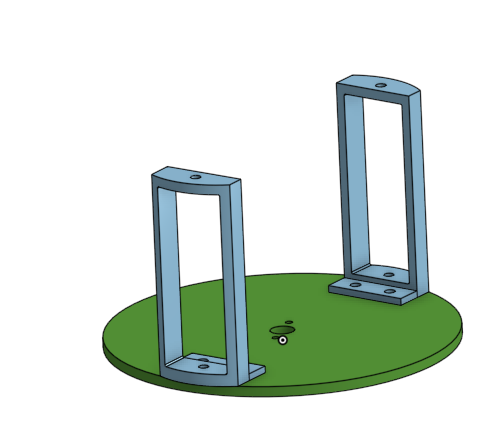

# SandwhichRobot3000

## Table of Contents
* [Assembly](#Assembly)
* [Base](#Base)
* [Potentiometer platform](#Potentiometer_Platform)
* [Servo Swivel](#Servo_Swivel)
* [Arms](#Arms)
* [Spatula](#Spatula)
---

Our project was to design a robot that would put a sandwhich together for you once it was loaded. This was necessary so that you could put it on while you went and did other things and then could come back for an already made sandwhich. Most of the parts were easy to design because we knew what they were going to do and figuring out the how came pretty easy after that. A serious design flaw was not realizing Onshape is different from real life with certain measurements, so many holes were not the right size or were forgotten all together (my bad) and so we got to use the drill to make them larger or shift them slightly after we originally cut the acryllic. 

No, we did not finish this project yet, but we have everything coming together and is on the way to being done. 

## Evidence

[Sandwhich Flipper Onshape](https://cvilleschools.onshape.com/documents/23afe8a9a6bca3f551e5893c/w/58240e3444805d98e7b97f96/e/02a63b4ea5cf56bc83ce4a2e)

## Assembly

### Reflection

The assembly came together well, except that it was never fully finished before we had to rush and cut our pieces out. While mating everything together, I quickly realized that I had forgotten some vital holes so things could connect to each other so I had to go back in and add those. The potentiometer platform had to be extended and worked with so that the nuts for the bolts on top of the platform would have space because of the area the potentiometers took up. The motors in the towers with the arms had to be secured in place and holes had to be added so everything was connected. It would have gone quicker if I had though everything through when I was originally designing the parts, like how they would fit together and connect. So next time I will definitely try to design the parts with the end goal in mind instead of just focusing on each piece. 

## Base 

The base is important for an initial support and place for the robot to sit. It was one of the easiest things to design in this project because it is just a big flat square base and I cut squares into so we could use that material in other places. 

### Evidence

### Potentiometer platform

### Reflection

This platform was designed where the potentiometers were upside down because we wanted them to just sit in it perfectly, however that turned out to be the wrong end of the potentiometer and we had to switch them so that the turny end faces up. This was really worrying at first because we weren't sure how to hold them in place but then we realized that with a nut they would stay in place. 

### Servo Swivel

### Reflection

This base is meant to turn the arm 360 degrees and make the arm more useful. Turns out, it doesn't sit flat but that doesn't impact the arm very much as far as we can see. The towers were 3D printed and fit the servos perfectly. 

## Arms 

### Reflection

These may have been the easiest part of the project to be honest, everything went smoothly with them. The only hold up was when we realized we needed to conenct the arms in the middle and had to add a 3D printed cylinder in 2 places so we drilled a hole to make it work. (And we didn't even end up using that hole but its fine.)

## Spatula

### Reflection
 
The onshape design worked great, once I added the needed holes after spatula 1... however we did go through like 5 more of these once lazer cut for various reasons, I snapped the corner of one, and then the rest were heat gun issues. Once hot, we moved the edges too far, or at a bad angle. However we finally got one perfect.

## Lessons Learned
1. 

