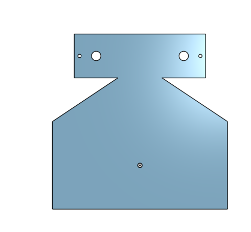

# SandwhichRobot3000

## Table of Contents
* [Assembly](#Assembly)
* [Base](#Base)
* [Potentiometer platform](#Potentiometer_Platform)
* [Servos Swivel](#Servo_Swivel)
* [Arms](#Arms)
* [Spatula](#Spatula)
---

Our project was to design a robot that would put a sandwhich together for you once it was loaded. This was necessary so that you could put it on while you went and did other things and then could come back for an already made sandwhich. Most of the parts were easy to design because we knew what they were going to do and figuring out the how came pretty easy after that. A serious design flaw was not realizing Onshape is different from real life with certain measurements, so many holes were not the right size or were forgotten all together (my bad) and so we got to use the drill to make them larger or shift them slightly after we originally cut the acryllic. 

No, we did not finish this project yet, but we have everything coming together and is on the way to being done. 

## Evidence

[Sandwhich Flipper Onshape](https://cvilleschools.onshape.com/documents/23afe8a9a6bca3f551e5893c/w/58240e3444805d98e7b97f96/e/02a63b4ea5cf56bc83ce4a2e)

## Assembly

### Reflection

The assembly came together well, except that it was never fully finished before we had to rush and cut our pieces out. While mating everything together, I quickly realized that I had forgotten some vital holes so things could connect to each other so I had to go back in and add those. The potentiometer platform had to be extended and worked with so that the nuts for the bolts on top of the platform would have space because of the area the potentiometers took up. The motors in the towers with the arms had to be secured in place and holes had to be added so everything was connected. It would have gone quicker if I had though everything through when I was originally designing the parts, like how they would fit together and connect. So next time I will definitely try to design the parts with the end goal in mind instead of just focusing on each piece. 

## Base 

The base is important for an initial support and place for the robot to sit. It was one of the easiest things to design in this project because it is just a big flat square base and I cut squares into so we could use that material in other places. 

### Evidence

### Potentiometer platform

## Servo Swivel 

### Reflection

## Arms 

### Reflection

## Spatula

### Reflection

## Spatula

### Reflection
 

